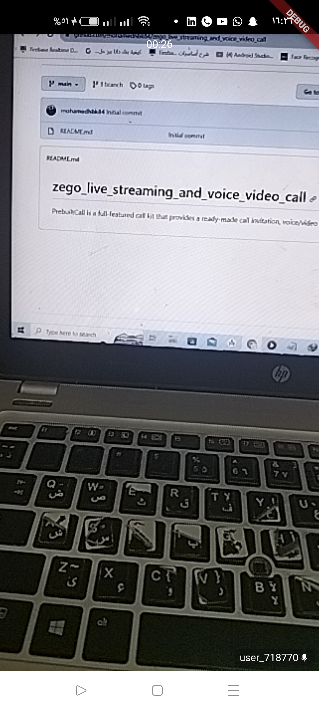
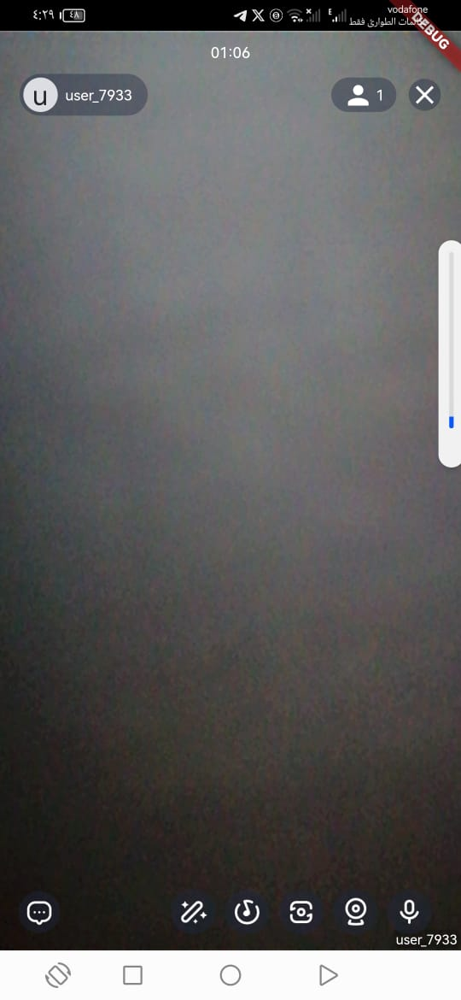
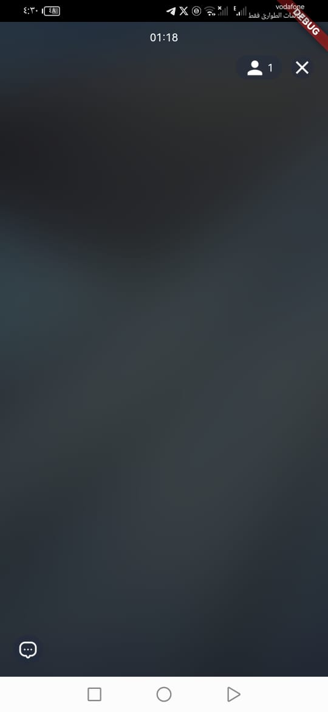

- - -
# Overview
- - -

**Live Streaming Kit** call and video **.





##  features

- Ready-to-use live streaming
- Customizable UI style
- Real-time interactive text chat
- Real-time audience capacity display
- Device management
- Extendable menu bar
- Co-hosting (make co-host & apply co-host)


## resources


* I want to get started to implement [a basic live stream](https://docs.zegocloud.com/article/14846) swiftly
* I want to get the [Sample Code](https://github.com/ZEGOCLOUD/zego_uikit_prebuilt_live_streaming_example_flutter)
* I want to get started to implement [a live stream with co-hosting](https://docs.zegocloud.com/article/14882)
* To [configure prebuilt UI](https://docs.zegocloud.com/article/14878) for a custom experience


## Integrate the SDK

### Add ZegoUIKitPrebuiltLiveStreaming as dependencies

Run the following code in your project's root directory: 

```dart
flutter pub add zego_uikit_prebuilt_live_streaming
```


### Import the SDK

Now in your Dart code, import the Live Streaming Kit SDK.

```dart
import 'package:zego_uikit_prebuilt_live_streaming/zego_uikit_prebuilt_live_streaming';
```


```dart
class LivePage extends StatelessWidget {
  final String liveID;
  final bool isHost;

  const LivePage({Key? key, required this.liveID, this.isHost = false}) : super(key: key);

  @override
  Widget build(BuildContext context) {
    return SafeArea(
      child: ZegoUIKitPrebuiltLiveStreaming(
        appID: yourAppID,// Fill in the appID that you get from ZEGOCLOUD Admin Console.
        appSign: yourAppSign,// Fill in the appSign that you get from ZEGOCLOUD Admin Console.
        userID: 'user_id',
        userName: 'user_name',
        liveID: liveID,
        config: isHost
            ? ZegoUIKitPrebuiltLiveStreamingConfig.host()
            : ZegoUIKitPrebuiltLiveStreamingConfig.audience(),
      ),
    );
  }
}
```
## Config your project

- Android:

1. If your project is created with Flutter 2.x.x, you will need to open the `your_project/android/app/build.gradle` file, and modify the `compileSdkVersion` to **33**.


   

2. Add app permissions.
Open the file `your_project/app/src/main/AndroidManifest.xml`, and add the following:

   ```xml
   <uses-permission android:name="android.permission.ACCESS_WIFI_STATE" />
   <uses-permission android:name="android.permission.RECORD_AUDIO" />
   <uses-permission android:name="android.permission.INTERNET" />
   <uses-permission android:name="android.permission.ACCESS_NETWORK_STATE" />
   <uses-permission android:name="android.permission.CAMERA" />
   <uses-permission android:name="android.permission.BLUETOOTH" />
   <uses-permission android:name="android.permission.MODIFY_AUDIO_SETTINGS" />
   <uses-permission android:name="android.permission.WRITE_EXTERNAL_STORAGE" />
   <uses-permission android:name="android.permission.READ_PHONE_STATE" />
   <uses-permission android:name="android.permission.WAKE_LOCK" />
   ```
    

3. Prevent code obfuscation.

To prevent obfuscation of the SDK public class names, do the following:

a. In your project's `your_project > android > app` folder, create a `proguard-rules.pro` file with the following content as shown below:

<pre style="background-color: #011627; border-radius: 8px; padding: 25px; color: white"><div>
-keep class **.zego.** { *; }
</div></pre>

b. Add the following config code to the `release` part of the `your_project/android/app/build.gradle` file.


<pre style="background-color: #011627; border-radius: 8px; padding: 25px; color: white"><div>
proguardFiles getDefaultProguardFile('proguard-android.txt'), 'proguard-rules.pro'
</div></pre>


- iOS:

1. Add app permissions.

a. open the `your_project/ios/Podfile` file, and add the following to the `post_install do |installer|` part:

```plist
# Start of the permission_handler configuration
target.build_configurations.each do |config|
  config.build_settings['GCC_PREPROCESSOR_DEFINITIONS'] ||= [
    '$(inherited)',
    'PERMISSION_CAMERA=1',
    'PERMISSION_MICROPHONE=1',
  ]
end
# End of the permission_handler configuration
```


b. open the `your_project/ios/Runner/Info.plist` file, and add the following to the `dict` part:

```plist
    <key>NSCameraUsageDescription</key>
    <string>We require camera access to connect to a live</string>
    <key>NSMicrophoneUsageDescription</key>
    <string>We require microphone access to connect to a live</string>
```


